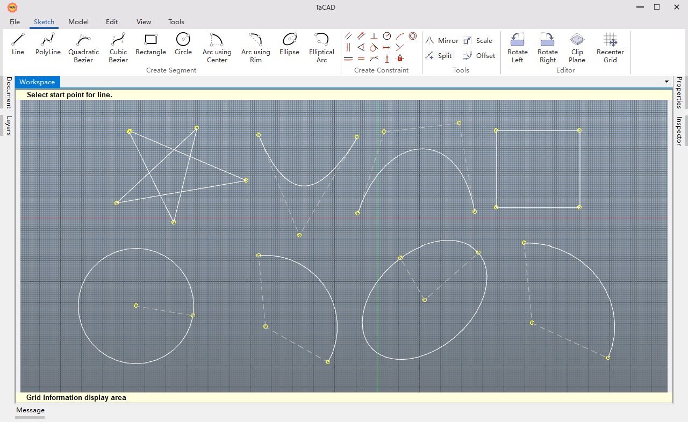

# Tacad2D

[](https://github.com/FerrixWang/Tacad2D/actions/workflows/cmake-windows.yml)

**Tacad2D: Cross-Platform 2D CAD Powered by OCCT OCAF**

> 🛠️ *Project Name Origin*:  
> **Tacad2D** stands for **"TAG CAD in 2D"**, where "**TA**" refers to "**TAG**" (Tag-based Architecture), reflecting its use of OCCT’s label-driven OCAF data structure.  
> Inspired by [Macad3D](https://github.com/Macad3D/Macad3D), an open-source 3D CAD system based on OCCT.

**Tacad2D** is a cross-platform 2D CAD application built on the [Open CASCADE Technology (OCCT)](https://dev.opencascade.org/) OCAF framework. It provides precise, efficient, and structured 2D design tools for engineers, architects, and developers, supporting mechanical schematics, architectural layouts, and circuit diagrams.



## Key Features

- **OCAF Label-Driven Design**: Organizes geometry, attributes, and relationships using OCCT’s hierarchical label system for scalable data management.
- **Cross-Platform**: Runs on Windows, Linux, and macOS.
- **Precision 2D Modeling**: Create constrained 2D sketches with a custom solver.
- **Modern UI**: Features a Ribbon-based interface and advanced docking panels using Qt.
- **High Performance**: Powered by OCCT’s geometric kernel for fast, reliable operations.
- **Open Source**: Fully extensible under the MIT License.

## Installation

### Prerequisites

- **CMake**: Version 3.15 or higher.
- **Qt**: Version 6.8.3 (MSVC 2022, 64-bit for Windows).
  - Required modules: `Core`, `Widgets`, `LinguistTools`, `Test`, `OpenGLWidgets`.
- **OpenCASCADE**: Version 7.9.1 (VC14, 64-bit).
- **Boost**: Version 1.81.0 (MSVC 2022).
- **Microsoft Visual Studio**: 2022 with C++ support.
- **Git**: For cloning the repository.

### Build Instructions

#### Windows (Primary Build Environment)
The following steps align with the GitHub Actions workflow for Windows.

1. **Clone the Repository**
   ```bash
   git clone https://github.com/FerrixWang/Tacad2D.git
   cd Tacad2D
   ```

2. **Set Up Dependencies**
   - **OpenCASCADE 7.9.1**:
     - Download [occt_vc14-64.zip](https://github.com/Open-Cascade-SAS/OCCT/releases/download/V7_9_1/occt_vc14-64.zip).
     - Extract to a directory of your choice, e.g., `C:\occt`.
   - **Qt 6.8.3**:
     - Install via the [Qt Online Installer](https://www.qt.io/download) for MSVC 2022 (64-bit).
     - Note the installation path, e.g., `C:\Qt\6.8.3\msvc2022_64`.
   - **Boost 1.81.0**:
     - Download from [Boost 1.81.0](https://www.boost.org/users/history/version_1_81_0.html).
     - Extract to a directory of your choice, e.g., `C:\boost`.

3. **Configure CMake**
   ```bash
   mkdir build
   cd build
   cmake .. ^
     -DCMAKE_BUILD_TYPE=Release ^
     -DOpenCASCADE_DIR="<path-to-occt>\occt_vc14-64\cmake" ^
     -DQt6_DIR="<path-to-qt>\6.8.3\msvc2022_64\lib\cmake\Qt6" ^
     -DBOOST_ROOT="<path-to-boost>" ^
     -DBOOST_NO_CMAKE=TRUE ^
     -DBOOST_NO_BOOST_CMAKE=TRUE
   ```
   Replace `<path-to-occt>`, `<path-to-qt>`, and `<path-to-boost>` with the actual paths where you extracted or installed the dependencies.

4. **Build the Project**
   ```bash
   cmake --build . --config Release --parallel
   ```

5. **Run Tacad2D**
   Binaries are in `build\Release`. Run:
   ```bash
   .\Tacad2D.exe
   ```

#### Linux/macOS
1. Install dependencies via package managers (e.g., `apt`, `brew`) or manually.
2. Clone and build:
   ```bash
   git clone https://github.com/FerrixWang/Tacad2D.git
   cd Tacad2D
   mkdir build && cd build
   cmake .. -DCMAKE_BUILD_TYPE=Release
   cmake --build . --parallel
   ./Tacad2D
   ```
   Set `OpenCASCADE_DIR`, `Qt6_DIR`, and `BOOST_ROOT` if needed.

### Troubleshooting
- Ensure dependency paths match the CMake configuration (e.g., `<path-to-occt>\occt_vc14-64\cmake`).
- For Windows, verify Visual Studio 2022 includes the C++ workload.
- Check [.github/workflows/cmake-windows.yml](.github/workflows/cmake-windows.yml) for exact dependency setup.

## Usage

1. **Create a Project**: Launch Tacad2D and start a new 2D project.
2. **Draw Geometry**: Use tools for lines, arcs, and polygons with constraint support.
3. **Manage with OCAF**: Organize layers, dimensions, and annotations via labels.
4. **Export**: Save to CAD formats like DXF or STEP.

See the `docs/` directory for detailed documentation.

## Contributing

We welcome contributions! To contribute:

1. Fork the repository.
2. Create a branch:
   ```bash
   git checkout -b feature/your-feature
   ```
3. Commit and push:
   ```bash
   git commit -m "Add your feature"
   git push origin feature/your-feature
   ```
4. Open a Pull Request.

See [CONTRIBUTING.md](CONTRIBUTING.md) for guidelines.

## Community

- **Contact**: Email [support@tagcad.com](mailto:support@tagcad.com).

## License

Tacad2D is licensed under the [MIT License](LICENSE).

## Acknowledgments

- Built on [Open CASCADE Technology](https://dev.opencascade.org/) OCAF framework.
- Inspired by [Macad3D](https://github.com/Macad3D/Macad3D) for architecture and design patterns.
